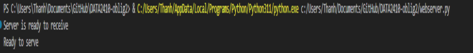

# DATA2410-oblig2
 
 
DATA2410 OBLOGATORY ASSIGNMENT 2
Made by s354587
 
 
Development and testing a web server
In this document I will go through  the development of the web server and testing the webserver by making a client.
Task 1: Making a simple webserver.
In the first task I copied and pasted the skeleton code for a webserver which is provided for us. Further, I wrote code inside the commented block to complete the webserver code. The result is shown in the image below:
 
Figure 1 "Ready to serve" output

 
Figure 2 Web server running properly

After running the webserver successfully, I tried to get a file that is not present in the server. I expected an error 404 message and successfully got an error 404 message. The result is shown in the image below:   
Figure 3 Expected 404 Not Found

 

Task 2: Making a client to test the webserver
In this task I made a simple client.py program to test the webserver. The result will come out as an output in terminal. See my code(client.py)
Task 3: Making a multi-threaded webserver
In this task I copied the simple webserver and added threading module to handle multiple requests. See my code(webserverExtended.py)

